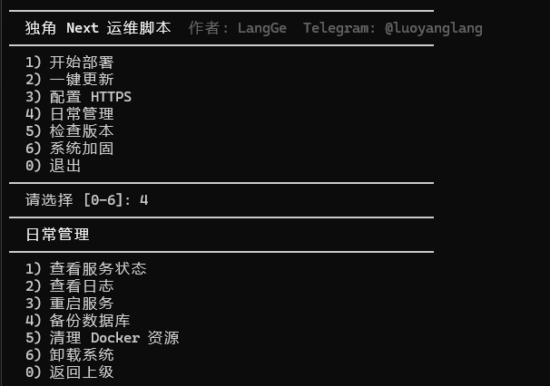

# LangGe Dujiao-Next Install Script

Language: **English** | [简体中文](./README.zh-CN.md)

> Maintainer: LangGe  
> Telegram: [@luoyanglang](https://t.me/luoyanglang)

## Overview

`langge-dujiao-next-install` is a community-maintained one-click deploy and ops script for Dujiao-Next.

It supports:

- Docker Compose deployment
- Binary deployment
- HTTPS setup
- Version check
- Basic daily operations
- Optional system hardening

This project is published as an independent community script and does not replace the official community deployment script.

## Use Cases

This script is a good fit for:

- new users who want to deploy `api + user + admin` quickly
- operators who want one unified entry for deploy, update, HTTPS, ops, and basic hardening
- users switching between Docker, binary, and panel-based external environments
- teams that want a more standardized deployment workflow with fewer manual steps

Less suitable for:

- heavily customized production orchestration
- teams already using mature IaC / CI/CD pipelines
- servers where SSH, firewall, and hardening changes must be handled manually

## Features

- Menu-driven workflow for deploy, update, HTTPS, ops, and hardening
- Covers `api + user + admin` in one script
- Supports Docker Compose, binary, and external-environment deployment modes
- Binary deployment supports:
  - SQLite + Redis
  - PostgreSQL + Redis
- Includes version checks, service operations, backups, cleanup, and uninstall
- Detects partial Docker installs and can clean residual state before reinstall
- Adds pre-checks for HTTPS, including local firewall handling and cloud firewall confirmation
- Uses safer state loading logic and avoids direct `curl | sh` for `acme.sh`

## Menu Structure

### Top-Level Menu

The script includes 6 top-level entries:

1. Start Deployment
2. One-Click Update
3. Configure HTTPS
4. Daily Operations
5. Check Versions
6. System Hardening

### 1. Start Deployment

Second-level deployment modes:

1. Docker deployment
2. Binary deployment
3. External environment deployment

#### 1.1 Docker deployment

Capabilities include:

- Auto install / check Docker and Docker Compose
- Docker mirror setup
- Redis kernel parameter fixes
- Database mode selection:
  - SQLite + Redis
  - PostgreSQL + Redis
- Version tag selection
- Custom deploy directory, timezone, API/User/Admin ports
- Redis port and password setup
- PostgreSQL port / db / user / password setup
- Host port pre-checks for Redis / PostgreSQL before Docker startup, with an explicit choice to stop old host services, re-enter the port, or cancel
- Default admin username and password setup
- Domain collection for User / Admin / API
- Optional HTTPS and ACME email configuration
- Auto-generated `.env`, `config.yml`, and compose files
- Image pull and service startup
- API health checks
- Detection and cleanup for incomplete previous Docker installs
- Wait for PostgreSQL / Redis to become healthy and restart app containers afterward
- Optional Nginx reverse proxy and HTTPS setup
- Local deployment state persistence

#### 1.2 Binary deployment

Capabilities include:

- Linux architecture detection (`x86_64` / `arm64`)
- Auto install required tools and Redis / Nginx
- Database mode selection:
  - SQLite + Redis
  - PostgreSQL + Redis
- Download API / User / Admin release packages
- Extract and install API binary and frontend assets
- Auto install local PostgreSQL when `PostgreSQL + Redis` is selected
- Pre-check local PostgreSQL availability before writing config
- Auto create / reuse PostgreSQL database and user, enforcing UTF-8 encoding for newly created local databases
- Generate API config, JWT, Redis, and queue settings
- Configure default admin account
- Write and enable a systemd service
- Generate Nginx site config
- Optional HTTPS integration
- Save local deployment state

#### 1.3 External environment deployment

For environments that already have 1Panel, Baota, PostgreSQL, Redis, or custom infra.

Capabilities include:

- Detect and choose existing Docker networks
- Custom version tag, deploy directory, and ports
- External PostgreSQL connection setup
- PostgreSQL connectivity and credential validation from the selected Docker network
- External Redis connection setup
- Redis connectivity and password validation from the selected Docker network
- Default admin account setup
- Auto-generate `config.yml` and `docker-compose.yml`
- Pull and start containers
- Save local deployment state
- Output reverse proxy instructions for panel-based setups

### 2. One-Click Update

Capabilities include:

- Read existing deployment state
- Compare current version with latest release
- Allow manual target version input
- Update by deployment mode:
  - Docker: change tag in `.env`, pull and restart
  - Binary: download and replace API / User / Admin packages
  - External: update image tags in `docker-compose.yml` and restart
- Write updated deployment state

### 3. Configure HTTPS

Mode-specific HTTPS flow:

- Docker: Nginx + `acme.sh`
- Binary: `acme.sh` + Nginx
- External: guidance only, handled in panel

Capabilities include:

- Domain resolution checks
- Automatic opening of local firewall ports `80/443` for UFW / firewalld
- Manual confirmation step for cloud firewall / security-group rules
- Automatic `socat` installation for standalone issuance
- ECC certificate re-issue fallback when old cert metadata exists but installable files are missing
- Certificate issuance
- Caddy / Nginx config generation
- Renewal task setup
- HTTPS state persistence

### 4. Daily Operations

Second-level menu:

1. View service status
2. View logs
3. Restart services
4. Backup database
5. Clean Docker resources
6. Uninstall system

Capabilities include:

- Status checks for Docker / systemd services
- API health checks
- Log viewing for API / User / Admin / all
- Restart API / User / Admin / Nginx / all
- SQLite / PostgreSQL backup
- Upload directory backup
- More accurate backup result reporting:
  - completed
  - partially completed
  - failed
- Docker cleanup
- Full uninstall with install dir, state file, and Nginx cleanup
- Binary uninstall also stops and disables Redis / PostgreSQL when they were installed by this script, preventing port conflicts when switching back to Docker mode

### 5. Check Versions

Capabilities include:

- Read saved deployment metadata
- Fetch latest releases from upstream repos
- Compare local API / User / Admin versions with latest versions
- Show deploy mode, install dir, db mode, HTTPS state, and domain info

### 6. System Hardening

Capabilities include:

- SSH / panel / custom port setup
- Root SSH login mode selection:
  - password + key (compatibility mode)
  - key-only login (more secure)
- Lynis install and checks
- Package upgrade and unattended upgrades
- Progress heartbeat during long package operations to reduce the risk of idle SSH disconnects
- SSH baseline hardening
- `sshd_config` validation and rollback
- `rsyslog` setup
- Kernel hardening via `sysctl`
- File permission tightening
- Fail2ban install and SSH jail
- UFW firewall setup
- Docker + UFW rule coordination
- UFW rollback on failure
- Disable risky protocols and USB storage
- Password policy and login restrictions
- System hardening is blocked on unsupported distros and currently only available for Debian / Ubuntu

## Safety Notes

Compared with simpler remote-execution scripts, this project includes extra safeguards:

- Deployment state is not loaded via direct `source state.env`
- `acme.sh` is downloaded to a local temporary file before execution
- Shell files are forced to use `LF` via `.gitattributes`

## Risk Notes

Please be aware of the following:

- the script modifies deploy directories, config files, Nginx, systemd, and Docker resources
- HTTPS setup writes Caddy or Nginx config and requests certificates
- system hardening modifies:
  - SSH config
  - UFW firewall
  - Fail2ban
  - password policies
  - kernel hardening settings
- if you choose key-only mode, root SSH password login will be rejected even when the password itself is correct
- binary deployment writes a systemd unit
- binary deployment may install and enable local Redis / PostgreSQL; uninstall only stops them when they were installed by this script
- Dujiao-Next requires PostgreSQL databases to use UTF-8 encoding; non-UTF-8 existing databases must be backed up and recreated before use
- default admin credentials are for bootstrap only and must be changed immediately

Recommended:

- test on a staging server first
- take snapshots or backups before running in production
- run the hardening menu only on a controllable or rollback-friendly server
- confirm security-group and firewall rules before changing SSH ports
- when running hardening over remote SSH, it is still recommended to use `tmux` or `screen`
- do not use the hardening menu on non-Debian / Ubuntu systems

## Requirements

- It is recommended to run the script as `root`
- If you are not using `root`, switch to `root` first or make sure the current user has full `sudo` privileges
- Linux
- `bash`
- `curl`
- `openssl`

For Docker mode:

- `docker`
- `docker compose`

For binary mode:

- `tar`
- `unzip`

## Quick Start

Before running the script, make sure the current shell has `root` privileges, for example:

```bash
sudo -i
```

or:

```bash
su - root
```

Recommended:

```bash
curl -fsSL https://raw.githubusercontent.com/dujiao-next/community-projects/main/scripts/langge-dujiao-next-install/dujiao-next-install.sh -o dujiao-next-install.sh
bash dujiao-next-install.sh
```

Mirror download:

```bash
curl -fsSL https://down.dujiao-next.cc/dujiao-next-install.sh -o dujiao-next-install.sh
bash dujiao-next-install.sh
```

Or run from local repository:

```bash
bash dujiao-next-install.sh
```

## Screenshots

### Main Menu


### Deployment Submenu


### Docker Deployment Flow


### Binary Deployment Flow


### Daily Operations Menu


### Version Check


### Version Check Details


### System Hardening


## Project Layout

```text
langge-dujiao-next-install/
  dujiao-next-install.sh
  assets/screenshots/
  README.md
  README.zh-CN.md
  LICENSE
  .gitattributes
```

## Compatibility

- Designed for Dujiao-Next community deployments
- Recommended to test on a fresh Debian / Ubuntu server before production use

## License

MIT. See [LICENSE](./LICENSE).
