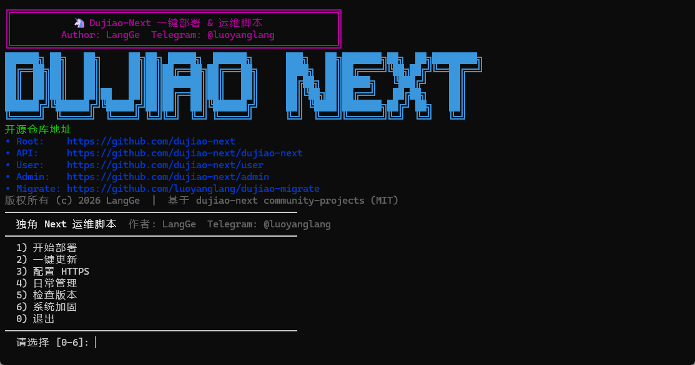
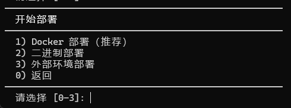
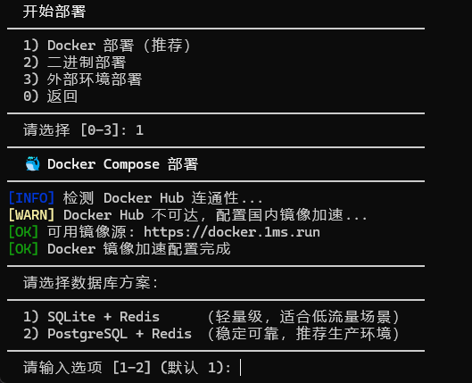
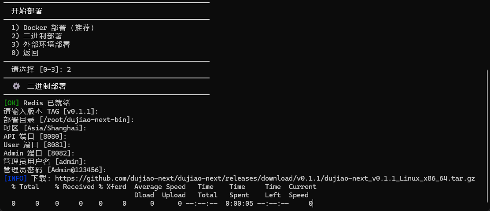
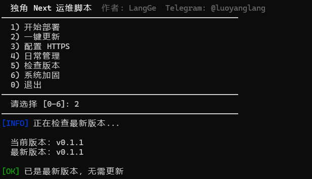
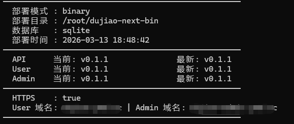
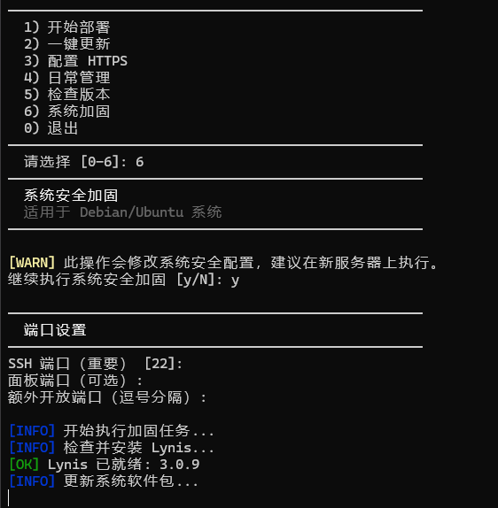

# LangGe Dujiao-Next 安装脚本

Language: [English](./README.md) | **简体中文**

> 维护者：LangGe  
> Telegram：[@luoyanglang](https://t.me/luoyanglang)

## 项目简介

`langge-dujiao-next-install` 是一个社区维护的 Dujiao-Next 一键部署与运维脚本。

支持能力包括：

- Docker Compose 部署
- 二进制部署
- 外部数据库支持
- HTTPS 配置
- 版本检查
- 基础日常运维
- 系统安全加固

这个项目以独立社区脚本的形式发布，不覆盖官方社区仓里已有的一键部署脚本。

## 适用场景

这份脚本更适合下面这些场景：

- 想快速部署 `api + user + admin` 的新用户
- 需要一份统一入口来完成部署、更新、HTTPS、运维和基础加固的运维人员
- 需要在 Docker、二进制、外部面板环境之间灵活切换的使用者
- 希望把部署过程标准化、减少手工配置步骤的团队

不太适合的场景：

- 完全定制化的生产环境编排
- 对基础设施已经有成熟 IaC / CI/CD 体系的团队
- 不希望脚本修改系统 SSH、防火墙、安全基线配置的服务器

## 功能列表

- 菜单式交互，适合新手与轻运维场景
- 覆盖 `api + user + admin` 三端部署、更新、HTTPS、运维与加固
- 同时支持 Docker Compose、二进制、外部环境三种部署形态
- 内置版本检测、日常管理、数据库备份、日志查看、服务重启
- 对状态文件读取与 `acme.sh` 安装方式做了额外安全收口

## 菜单结构与完整功能

### 一级菜单

脚本主菜单包含 6 个功能入口：

1. 开始部署
2. 一键更新
3. 配置 HTTPS
4. 日常管理
5. 检查版本
6. 系统加固

### 1. 开始部署

二级菜单包含 3 种部署模式：

1. Docker 部署（推荐）
2. 二进制部署
3. 外部环境部署

#### 1.1 Docker 部署

三级能力包括：

- 自动安装 / 检查 Docker 与 Docker Compose
- 自动配置 Docker 镜像源
- 自动修复 Redis 相关内核参数
- 选择数据库模式：
  - SQLite + Redis
  - PostgreSQL + Redis
- 选择镜像版本 TAG
- 自定义部署目录、时区、API/User/Admin 端口
- 自定义 Redis 端口与密码
- PostgreSQL 模式下自定义数据库端口、库名、用户名、密码
- 设置默认管理员用户名与密码
- 收集域名配置：
  - User 域名
  - Admin 域名
  - API 域名
  - 是否启用 HTTPS
  - ACME 邮箱
- 自动生成：
  - `.env`
  - `config/config.yml`
  - `docker-compose.sqlite.yml`
  - `docker-compose.postgres.yml`
- 自动拉取镜像并启动服务
- 自动执行 API 健康检查
- 自动安装 Nginx
- 支持两种站点接入方式：
  - HTTP 反向代理
  - 申请证书并自动配置 HTTPS
- 部署完成后自动保存本地部署状态

#### 1.2 二进制部署

三级能力包括：

- 自动识别 CPU 架构：
  - Linux x86_64
  - Linux arm64
- 自动安装依赖：
  - `tar`
  - `unzip`
  - `curl`
  - `redis-server`
  - `nginx`
- 自动下载 API / User / Admin Release 包
- 自动解压并安装：
  - API 二进制
  - User 前端静态文件
  - Admin 前端静态文件
- 自动生成 API 配置文件
- 自动生成 JWT / User JWT / Redis 队列配置
- 自动设置默认管理员账户
- 自动写入 systemd 服务
- 自动配置 Nginx 站点
- 可选域名 + HTTPS 配置
- 自动写入本地部署状态

#### 1.3 外部环境部署

适用于已经有 1Panel / 宝塔 / 外部 PostgreSQL / 外部 Redis 的场景。

三级能力包括：

- 检测并选择现有 Docker 网络
- 自定义镜像版本 TAG
- 自定义部署目录与三端端口
- 录入外部 PostgreSQL 连接信息
- 录入外部 Redis 连接信息
- 设置默认管理员账户
- 自动生成：
  - `config.yml`
  - `docker-compose.yml`
- 自动拉取并启动容器
- 自动保存本地部署状态
- 输出面板侧需要配置的反向代理说明

### 2. 一键更新

根据已保存的部署状态执行更新。

二级能力包括：

- 自动检查当前版本与最新版本
- 支持手动输入目标版本
- 按部署模式分别更新：
  - Docker 模式：更新 `.env` 中 TAG，重新拉取镜像并重启
  - 二进制模式：下载新版本 API / User / Admin 包并替换
  - 外部环境模式：更新 `docker-compose.yml` 镜像 TAG 并重启
- 更新完成后写回部署状态

### 3. 配置 HTTPS

根据部署模式选择不同的 HTTPS 方案：

- Docker 模式：Caddy 自动签发与续期
- 二进制模式：`acme.sh` + Nginx
- 外部环境模式：提示在面板中自行配置证书

三级能力包括：

- 域名解析预检查
- 证书申请
- Nginx/Caddy 配置写入
- 自动续期任务配置
- HTTPS 状态写回本地状态文件

### 4. 日常管理

二级菜单包含：

1. 查看服务状态
2. 查看日志
3. 重启服务
4. 备份数据库
5. 清理 Docker 资源
6. 卸载系统

三级能力包括：

- 查看服务状态：
  - Docker / 外部环境：查看 compose 服务状态
  - 二进制模式：查看 systemd 服务状态
  - API 健康检查
- 查看日志：
  - API
  - User
  - Admin
  - 全部
- 重启服务：
  - Docker 模式：重启 API / User / Admin / 全部
  - 二进制模式：重启 API 服务 / Nginx / 全部
- 备份数据库：
  - SQLite 备份
  - PostgreSQL 备份
  - 上传目录备份
- 清理 Docker：
  - 停止容器
  - 无用镜像
  - 无用网络
  - 构建缓存
- 卸载系统：
  - 停止服务
  - 删除安装目录
  - 删除状态文件
  - 清理 Nginx 配置

### 5. 检查版本

功能包括：

- 读取本地部署状态
- 获取官方最新 Release 版本
- 对比 API / User / Admin 当前版本与最新版本
- 展示部署模式、部署目录、数据库类型、HTTPS 状态、域名信息

### 6. 系统加固

这部分本身就是一个独立的系统加固工具集。

三级能力包括：

- 自定义 SSH 端口、面板端口、额外开放端口
- 检查并安装 Lynis
- 系统更新与自动安全更新
- 安装 `libpam-tmpdir`
- SSH 安全基线配置
- `sshd_config` 校验与回滚
- `rsyslog` 与日志权限配置
- `sysctl` 内核安全参数
- 系统文件权限修复
- Fail2ban 安装与 SSH Jail 配置
- UFW 防火墙配置
- Docker 与 UFW 规则协同
- UFW 规则失败回滚
- 禁用高风险协议与 USB 存储
- `login.defs` 基础策略
- `pwquality` 密码复杂度策略
- 登录 Banner 与 `su` 限制

## 安全说明

相较于更简单的远程执行脚本，这个项目额外做了几项安全收口：

- 不再通过 `source state.env` 直接执行状态文件
- `acme.sh` 改为先下载到本地临时文件再执行
- 通过 `.gitattributes` 固定 `*.sh` 为 `LF`，避免 Windows 换行符导致安装失败

## 风险提示

请在使用前注意下面这些风险点：

- 脚本会修改部署目录、配置文件、Nginx、systemd、Docker 资源
- 启用 HTTPS 时会申请证书，并写入 Caddy / Nginx 配置
- 执行系统加固时会修改：
  - SSH 配置
  - UFW 防火墙
  - Fail2ban
  - 密码策略
  - 内核安全参数
- 二进制部署会写入 systemd 服务文件
- 默认管理员账号密码仅适合初始化使用，部署完成后必须立即修改

建议：

- 先在测试机验证流程
- 在正式环境执行前做好快照或备份
- 系统加固功能建议在新服务器或可回滚环境中执行
- 远程 SSH 连接环境下，修改 SSH 端口前请先确认安全组 / 防火墙策略

## 环境要求

- 建议使用 `root` 用户执行脚本
- 如果不是 `root`，请先切换到 `root`，或确保当前用户具备完整 `sudo` 权限
- Linux
- `bash`
- `curl`
- `openssl`

Docker 模式：

- `docker`
- `docker compose`

二进制模式：

- `tar`
- `unzip`

## 使用方式

执行前请先确认当前会话具备 `root` 权限，例如：

```bash
sudo -i
```

或：

```bash
su - root
```

推荐方式：

```bash
curl -fsSL https://down.dujiao-next.cc/dujiao-next-install.sh -o dujiao-next-install.sh
bash dujiao-next-install.sh
```

如果已经在本地仓库中：

```bash
bash dujiao-next-install.sh
```

## 功能截图

### 主菜单


### 部署二级菜单


### Docker 部署流程


### 二进制部署流程


### 日常管理菜单


### 版本检查


### 版本检查明细


### 系统安全加固


## 目录结构

```text
langge-dujiao-next-install/
  dujiao-next-install.sh
  assets/screenshots/
  README.md
  README.zh-CN.md
  LICENSE
  .gitattributes
```

## 兼容性说明

- 面向 Dujiao-Next 社区部署场景
- 建议先在全新 Debian / Ubuntu 服务器上测试，再用于正式环境

## 开源协议

MIT，详见 [LICENSE](./LICENSE)。
